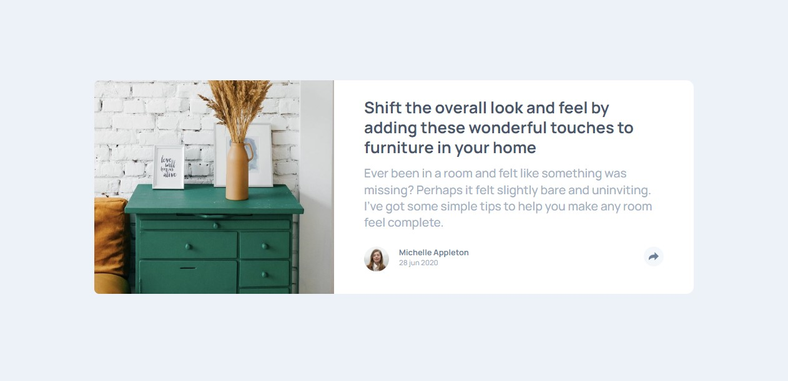

# Frontend Mentor - Article preview component solution

This is a solution to the [Article preview component challenge on Frontend Mentor](https://www.frontendmentor.io/challenges/article-preview-component-dYBN_pYFT). Frontend Mentor challenges help you improve your coding skills by building realistic projects.

## Table of contents

- [Overview](#overview)
  - [The challenge](#the-challenge)
  - [Screenshot](#screenshot)
  - [Links](#links)
- [My process](#my-process)
  - [Built with](#built-with)
  - [What I learned](#what-i-learned)
  - [Continued development](#continued-development)
- [Author](#author)

## Overview

### The challenge

The chalenge is to try and replicate the original design as close as possible.

Design should be responsive across different user's screen sizes, e.g desktop, tablet and mobile .

Using javascript to implent a toggle on the share link, a user should be able to see the soial media links when they click on the share icon\.

### Screenshot



### Links

- Solution URL: [Add solution URL here](https://github.com/CelineJames/frontend-mentor/tree/main/article-preview)
- Live Site URL: [Add live site URL here](https://your-live-site-url.com)

## My process

### Built with

- Semantic HTML5 markup
- CSS custom properties
- Flexbox
- CSS Grid
- Mobile-first workflow

### What I learned

I have gotten comfortable with the use of CSS Grid.

I learnt i could use the ::before psuedo-element combined with transform to do soething creative.

```css
.share::before {
  content: "";
  position: absolute;
  height: 30px;
  width: 30px;
  left: calc();
  left: 6rem;
  bottom: -12px;
  background-color: var(--dark-blue);
  transform: rotateZ(45deg);
  z-index: 1;
}
```

### Continued development

I would continue to devlop my skills in CSS, to get better and get comfortable using CSS variables more.

I would earna nd practice using SASS.

I would learna nd practice with more javascript projects.

## Author

- Frontend Mentor - [@CelineJames](https://www.frontendmentor.io/profile/CelineJames)
